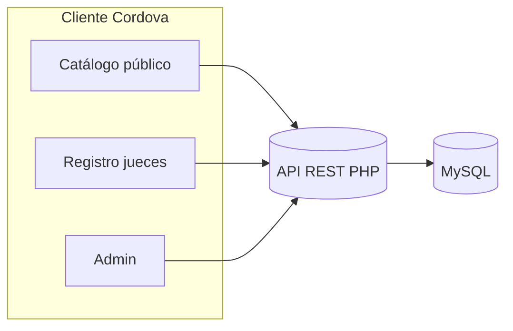

# Competencia de Robots

**Aplicación móvil híbrida** para la gestión integral de una competencia universitaria de robots: consulta pública, verificación en campo y administración centralizada. Desarrollada con **Apache Cordova** para despliegue en **Android** y **navegador**, con interfaz responsiva orientada a jueces, organizadores y público general.

---

## Descripción general

La plataforma unifica en una sola app el ciclo operativo del evento: desde la consulta de categorías y equipos hasta el registro oficial en pista y el panel de configuración del torneo. El frontend consume una **API REST** remota (PHP/MySQL en producción); este repositorio contiene únicamente el **cliente Cordova** y la cadena de build.

| Módulo | Rol | Capacidades principales |
|--------|-----|-------------------------|
| **Catálogo público** | Consulta | Categorías, reglamento, equipos, búsqueda, fichas de detalle, listado de validados |
| **Registro de jueces** | Verificación en evento | Checklist por categoría, aprobación/descalificación, sincronización con servidor |
| **Administración** | Organización | Login, panel, CRUD de categorías y reglas, asignación de equipos por modalidad |

---

## Características destacadas

- **Diseño responsivo** — Layout adaptable a móvil, tablet y escritorio; menú, tablas y checklist optimizados para uso en pista.
- **Arquitectura modular** — Código organizado en `www/js/` por dominios (`catalog`, `admin`, `registro`, `api`, `core`).
- **Enrutamiento SPA** — Navegación sin recargas mediante router propio y vistas HTML parciales.
- **Integración API** — Cliente HTTP configurable; modo mock para desarrollo offline.
- **UI consistente** — Tailwind CSS, iconografía Heroicons y componentes reutilizables.
- **Build multiplataforma** — Un mismo `www/` para browser (desarrollo) y APK Android (producción).

---

## Stack tecnológico

| Capa | Tecnología |
|------|------------|
| Contenedor | Apache Cordova 13 (browser + Android) |
| Interfaz | HTML5, JavaScript (ES5 modular), Tailwind CSS 3 |
| Iconos | Heroicons (sincronización vía script) |
| Estilos | PostCSS + Tailwind (`input.css` → `app.css` minificado) |
| Desarrollo | Express (servidor local), proxy API opcional, `concurrently` para watch |
| Backend (externo) | API PHP + MySQL — no incluida en este repositorio |

---

## Requisitos

- **Node.js** 18+ y npm
- **JDK** y Android SDK (solo para compilar APK)
- Acceso a la URL del API configurada en `www/js/config.js`

---

## Inicio rápido

```bash
# Dependencias
npm install

# Compilar estilos e iconos; preparar plataforma browser
npm run browser
```

El comando `browser` levanta el servidor de desarrollo y abre la app en el navegador. Para iterar con recarga de CSS y vistas:

```bash
npm run dev          # watch CSS + prepare Cordova
npm run watch:css    # solo Tailwind
```

### Build Android (APK debug)

```bash
npm run build:android
```

Para una compilación limpia:

```bash
npm run build:android:clean
```

---

## Configuración del API

Edite `www/js/config.js`:

| Opción | Descripción |
|--------|-------------|
| `apiRemoteBase` | URL base del API en producción (sin barra final) |
| `useMockApi` | `true` para datos locales sin servidor |
| `apiDirectEnLocalhost` | Llamada directa al host remoto desde localhost |
| `registroEnvioHabilitado` | Habilita envío de verificaciones al servidor |

Ejemplo:

```javascript
apiRemoteBase: 'https://tudominio.com/api',
useMockApi: false,
```

En desarrollo local con PHP en la máquina, use `npm run browser` y el proxy documentado en `scripts/dev-server.cjs` (ruta `/api`).

---

## Estructura del proyecto

```
├── www/                 # Código fuente de la aplicación
│   ├── css/             # Tailwind (src) y app.css generado
│   ├── js/              # Lógica por módulo (catalog, admin, registro, api)
│   ├── views/           # Plantillas HTML por pantalla
│   └── img/             # Recursos gráficos
├── scripts/             # Servidor dev, proxy API, utilidades de build
├── hooks/               # Hooks Cordova (prepare, proxy browser)
├── res/                 # Recursos nativos (Android, browser)
├── config.xml           # Manifiesto Cordova
└── package.json         # Scripts npm y dependencias
```

> **Nota:** La carpeta `backend/` (PHP, SQL, despliegue) permanece **fuera de este repositorio** por decisión del equipo. Configure el servidor y la base de datos en el entorno de hosting correspondiente.

---

## Scripts npm relevantes

| Comando | Uso |
|---------|-----|
| `npm run build:css` | Genera `www/css/app.css` desde Tailwind |
| `npm run icons:sync` | Copia iconos Heroicons usados en la app |
| `npm run prepare:all` | CSS + iconos + prepare browser y Android |
| `npm run serve` | Servidor estático sin abrir navegador |
| `npm run android:install-logcat` | Instala APK y muestra logcat (depuración) |

---

## Flujo de datos (resumen)



---

## Licencia

Proyecto basado en plantilla **Apache Cordova** — [Apache License 2.0](https://www.apache.org/licenses/LICENSE-2.0).

---

*Universidad Tecnológica del Norte de Coahuila — Competencia de Robots*
